# ASE HW3

## extend.py
- This divides the dataset into 2 parts.
    - low_dimension datasets
    - high dimension datasets

- After running this file, and doing some manual processing, I get 2 files:
    - hi_dimension_file_paths.txt
    - lo_dimension_file_paths.txt

- As the name suggests, these have the file paths to the high dimension and low dimension datasets.

## dumb_vs_smart.py
- This file has the implementation of the pseudo code in HW3 assignment.

- To run this for individual files
    - python3 dumb_vs_smart.py <filepath_for_csv>
    - This will output the stats.report on the console.

## test.py
- This file has all the tests for checking if the functions used in dumb_vs_smart.py work as expected

- To run the tests
    - pytest test.py

## Makefile
- Makefile has been modified to add 2 actions: actlodim and acthidim
- Both these run to generate a bash script that gets the output for low dimension and high dimension files respectively

- to run the makefile action for low dimension datasets
    - make Act=branch actlodim > ~/tmp/branch.sh
    - to run the rq.sh script for summary
        - cd ~/tmp
        - bash branch.sh
        - cd branch
        - bash /workspaces/ezr/etc/rq.sh

- to run the makefile action for high dimension datasets
    - make Act=branch acthidim > ~/tmp/branch.sh
    - to run the rq.sh script for summary
        - cd ~/tmp
        - bash branch.sh
        - cd branch
        - bash /workspaces/ezr/etc/rq.sh

## Results
1. For individual dataset result go to the folders 
    - hi_dim_result
    - lo_dim_result

2. LOW DIM RESULTS
    - SS-A

        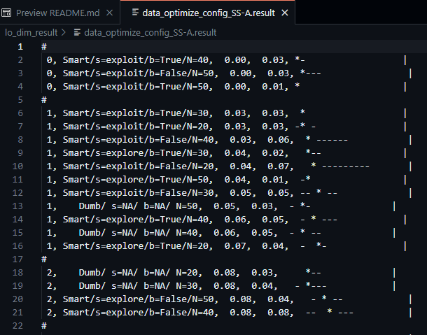

        In this scenario, Smart strategies outperform Dumb strategies, indicating a more consistent performance with lower error rates. The exploitative conduct (s=exploit) that the smart strategies probably profit from allows them to identify better answers more quickly than random guessing. The findings demonstrate that, although dumb techniques do quite well in this situation, the smart strategy has a distinct edge.

    - SS-B

        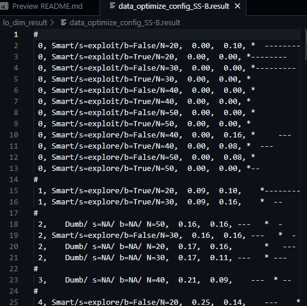

        Similar to SS-A, Smart strategies perform better than Dumb strategies. The structured approach of Smart strategies, which might focus on either exploitative or explorative behaviors, shows its strength in this low-dimensional scenario. Even though Dumb strategies might provide a comparable solution in some iterations, Smart consistently achieves lower error rates.

    - SS-D

        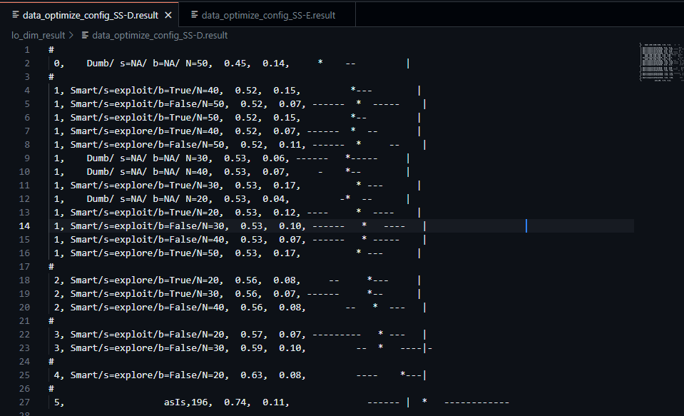

        Interestingly, Dumb outperforms Smart in this case. However, the standard deviation (SD) and the median error are notably high, suggesting significant variability in Dumb's performance. This high SD implies that Dumb strategies may occasionally perform better but lack consistency. The high median error also highlights that even when Dumb outperforms, the quality of the solution can be poor, pointing to the unpredictability of random guessing in this low-dimensional setup.

    - SS-E

        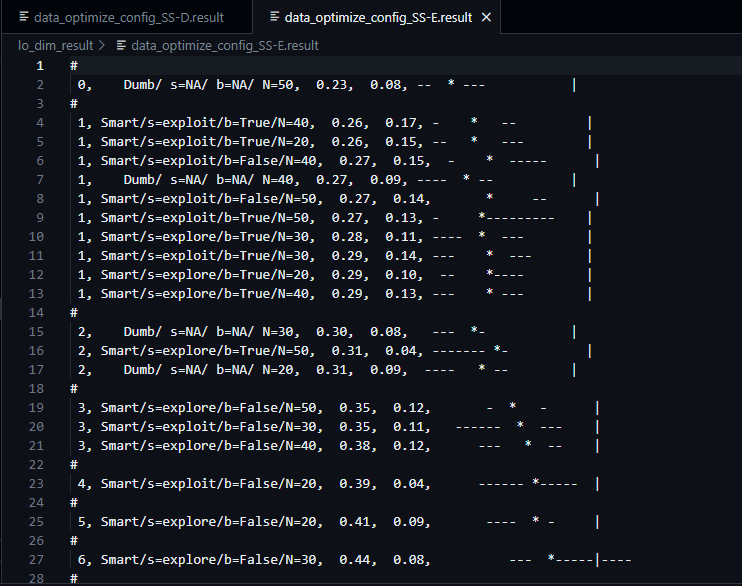

        Similar to SS-D, Dumb performs better than Smart. However, the large standard deviation and median error indicate high variability and lower reliability of the Dumb strategy. While it occasionally performs well, the results are inconsistent and often fall short in terms of solution quality, demonstrating the erratic nature of random guessing.
        
    - SS-F

        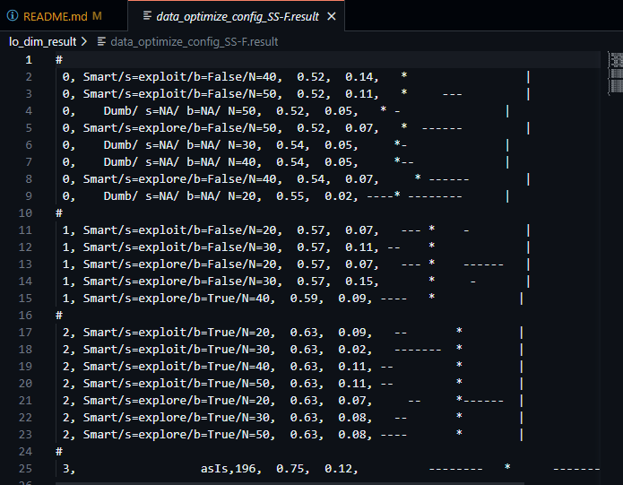

        Here, Smart strategies outperform Dumb once again. This consistent performance suggests that the Smart strategy's ability to either exploit known good solutions or explore better ones provides a more reliable approach in this scenario. Dumb strategies, though potentially useful, fail to achieve the same level of performance with as much consistency or precision.

3. HIGH DIM RESULTS
    - Apache_AllMeasurements

    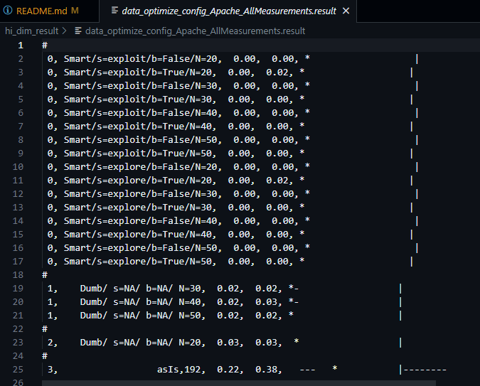

    Smart techniques obviously outperform dumb strategies in this high-dimensional setting. Because of the dataset's intricacy, smart strategies—which effectively explore and exploit the solution space—are encouraged. Random guessing-based dumb methods are less effective in these complicated contexts and yield inferior results.

    - HSMGP_num

    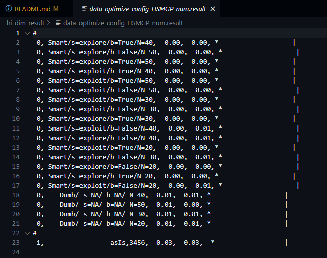

    Smart strategies outperform Dumb strategies in this dataset as well. The high dimensionality makes random guessing (Dumb) ineffective, as it likely fails to explore the solution space efficiently. Smart approaches, which use sophisticated techniques, show better adaptability and performance in these complex scenarios.

    - data_optimize_process_xomo_flight

    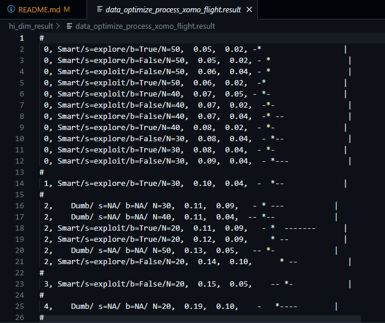

    Once again, Smart strategies come out ahead in this high-dimensional case. 

    - data_optimize_process_xomo_ground

    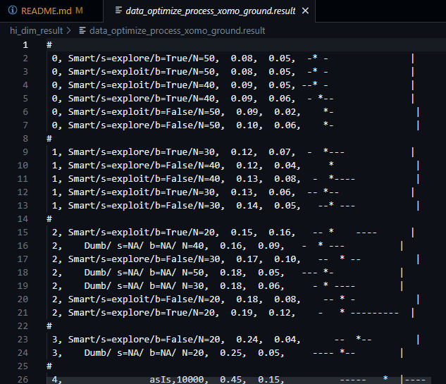

    Smart strategies demonstrate superior performance in this scenario as well.

    - data_optimize_process_xomo_osp

    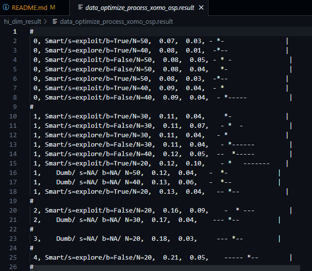

    Smart performs better than Dumb here too.

    - data_optimize_process_xomo_osp2

    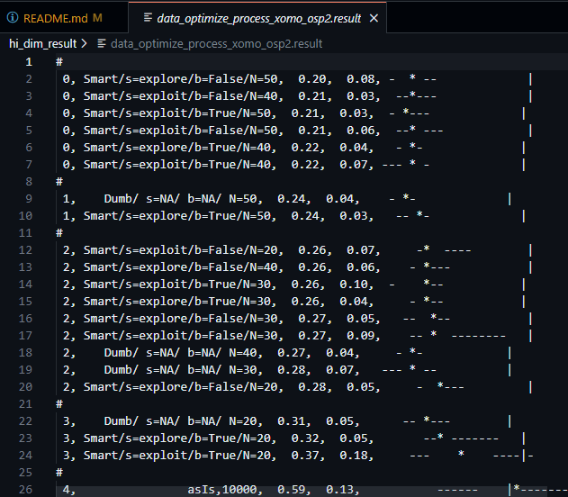

    
    As with the other high-dimensional results, Smart strategies outperform Dumb strategies here too.

## Conclusions
- The data shows that random guessing becomes increasingly ineffective as the dimensionality increases. With smaller standard deviations, the Smart methods start to regularly beat the random guessing method, indicating more stable and trustworthy outcomes for higher-dimensional data.

- The data also shows that dumb guessing rarely work for smaller dimension data. When the dumb works the best, the error margins are too high

- We conclude that JJR1 holds true for only some low dimension output. Even when it holds true, the standard deviation is large.
    - (For example in lo_dim_result/data_optimize_config_SS-D.result)
    - the standard deviation is 0.14

- On the other hand JJR2 holds true for high dimension data.

- Therefore, we agree with JJR2 and disagree with JJR1.

## Bottleneck
- We were unable to successfully run rq.sh on our data.
- We believe it is a formatting issue.
- We were hence not able to get the summary result.
- All our conclusions will be on the basis of the indidual results.

